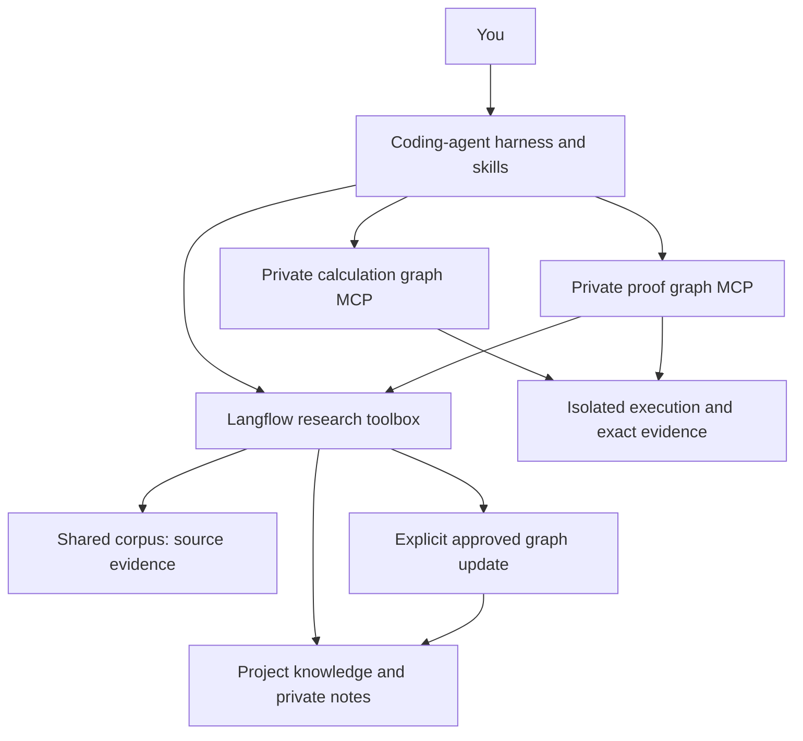

# NIMA-Semantica

NIMA is a modular library for auditable scientific work with a coding-agent harness.
Compose specialized workflows in Langflow, connect them through MCP, and use research skills to investigate questions with persistent evidence and computational tools.
NIMA combines a shared corpus graph, built on an adjustable ontology, with a separate project graph that records your artifacts and ongoing work.
Your agent can return to this context when you resume an investigation.



The corpus records sources and their provenance.
Project knowledge records an investigation's proposals, dependencies and accepted updates.
Private calculation and proof graphs preserve working state, revisions and failed routes separately from project knowledge.
All three can survive the end of a chat session.

## Start here

Use Ubuntu/Linux or macOS on Apple silicon with Python 3.11–3.13 in a dedicated environment.
The macOS deployment runs Langflow natively in a dedicated Python environment, with Docker Desktop execution workers. No Langflow Desktop account is required.
See the [platform verification status](docs/PLATFORM_SUPPORT.md) for release qualification and tested configurations.
Install the release wheel, then run the setup wizard:

```sh
python -m venv .venv
.venv/bin/pip install 'nima_semantica-0.1.3-py3-none-any.whl[mcp]'
.venv/bin/nima setup --provision --pdf --lean
.venv/bin/nima project init my-research --corpus papers --path /path/to/project
```

On Linux, install `torch==2.13.0+cpu` from `https://download.pytorch.org/whl/cpu` before the wheel to select the CPU build. On macOS, use the native PyPI build selected by pip.

The [user guide](docs/README.md) covers prerequisites, model configuration, Codex/Claude Code/OpenCode connections and continuing an existing project.
A shared tool model and optional overrides configure every model-using workflow; the harness controls its own model.
The same wizard supports native Anthropic, Gemini and Ollama plus OpenAI-compatible endpoints. LLM and embedding choices are independent; an all-local Ollama or compatible-server setup needs no paid cloud credentials.

```sh
nima ingest papers /path/to/paper.pdf
nima ingest papers /path/to/notes.md --project my-research
nima project status my-research --corpus papers
nima export okf --corpus papers --project my-research --output ./okf-snapshot
```

Ask the harness to **chat with the knowledge base**, conduct a literature review, calculate a quantity, draft a proof or investigate a claim.
Skills guide tool use without imposing a fixed research pipeline.
See [workflow contribution](docs/CONTRIBUTING_WORKFLOWS.md) to add your own Langflow workflow.

## Research skills

Skills give your coding agent adaptable procedures for using the tools and retaining useful results.
Project initialization installs all ten for your selected harnesses.

| Skill | What you can ask for |
| --- | --- |
| [Chat with the knowledge base](docs/skills/nima-corpus-chat.md) | Answers from corpus literature and private project notes, with exact citations. |
| [Ingest papers](docs/skills/nima-ingest.md) | Full or provisional fast ingestion, ontology-guided extraction, and approved graph updates. |
| [Normalize vocabulary](docs/skills/normalize-vocabulary.md) | Evidence-backed terms, aliases and usage distinctions from the linked project graph. |
| [Research](docs/skills/nima-research.md) | An investigation combining evidence and specialist checks. |
| [Literature review](docs/skills/nima-literature-review.md) | Literature discovery, synthesis and comparison. |
| [Review](docs/skills/nima-review.md) | A focused assessment of a claim, proof or artifact. |
| [Critique](docs/skills/nima-critique.md) | An audit of argument gaps, conflicts and possible repairs. |
| [Calculate mathematics](docs/skills/nima-calculate-mathematics.md) | An inspectable derivation in a private calculation graph. |
| [Draft proof](docs/skills/nima-draft-proof.md) | Alternative strategies, lemmas and open obligations. |
| [Conduct proof](docs/skills/nima-conduct-proof.md) | A developed argument in a private proof graph. |
| [LaTeX to Lean](docs/skills/nima-latex-to-lean.md) | Formalization and scoped Lean verification. |

See the [skill guide](docs/skills/README.md) for examples and the [tool catalogue](docs/TOOLS.md) for callable interfaces.

## Development and citation

```sh
python -m pip install -e '.[test,mcp]'
python -m pytest -q
```

NIMA is under active development; contributions, including custom Langflow workflows, are welcome.
Use [CITATION.cff](CITATION.cff) for author and release metadata. The [v0.1.0 archive](https://doi.org/10.5281/zenodo.22998905) remains available; no versioned DOI is asserted for v0.1.3 before publication.
See [LICENSE](LICENSE) and [THIRD_PARTY_NOTICES.md](THIRD_PARTY_NOTICES.md) for project and third-party terms.
